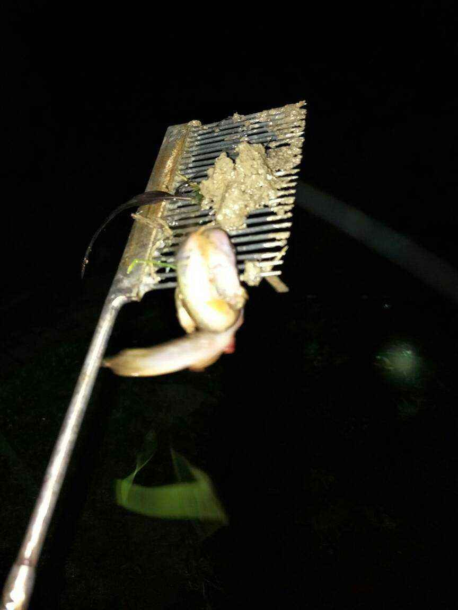

泥鳅捉带给我们非常多的乐趣，一到春秋两季，特别是稻田犁田插秧后，就是我们一群小伙伴活跃在稻田间的时候。

泥鳅捉的制作非常的简单，一般我们会提前收集好废弃的牙刷，让季节到了，花点钱去买一包针。把针烧热，插入牙刷把上，整整齐齐的排成一排，然后砍一根适合的竹竿，将其绑好，就可以出发去捉泥鳅啦。

别小瞧了这玩意，捉泥鳅起来可是一把手，最好的时间点是晚上，晚上似乎泥鳅都在睡觉，而都钻出泥洞了，拿着手电照着也不会跑，用泥鳅捉的刺头部分，对准泥鳅的中部，蒙扎一下，泥鳅就到手了。

往往一个晚上就能抓满满的小半桶。

不但可以抓到泥鳅，还可以抓到黄鳝，甚至有的时候稻田里能看到非常大的黑蛇，我们家乡称之为“黑风骚”。但蛇的皮很硬，一般都很难刺起来。

当然白天也可以用鱼刺去捉泥鳅，泥鳅会从洞中伸出一个小头，预估出泥鳅的身体走向后，就可以下手猛扎了。

对于吃泥鳅，记忆到是甚少，但对于捉泥鳅，确实觉得小时候经常这么干，并且乐意这么干。可能是因为捉回去的泥鳅妈妈都不愿意处理，而且一般是几个小伙伴一起弄的，所以都是自己做的吧，可能味道不是很好。

现在小孩子的玩具非常多，但当年泥鳅捉就是我们的玩具，几乎每年都要弄一把。后面好像都不用自己制作了，可以在五金店买到现成的了，但我还是感觉自己做更有乐趣一些。

现在老家已经不很少有人在种稻田了，老家也都没有小学了。大家都是在乡镇或县城里读书，感觉这种娱乐活动也会慢慢变成历史了吧。