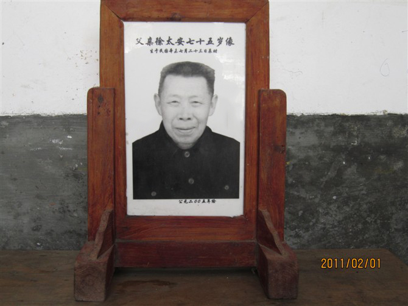

爷爷过世是我高中的时候，记得好像是高二，是一个青梅竹马的朋友告诉我的，听到这个消息的时候，我脑子一片空白。不知道是太伤心还是太诧异了！！

当晚我就没有上自习，一个晚上躲在操场角落里，待了很晚，然后在班主任房间的楼顶待了很久，可能不知道怎么说吧。

最终鼓起勇气，敲了班主任的门，告诉他我爷爷去世了，我要回去。

回到家，我一直没怎么说话，几个嫂子劝我节哀顺便，我默默的走到了爷爷棺材前，跪下了。没有嚎啕大哭，但我真的很伤心。

我觉得爷爷是这个世界上最爱我的人，现在也是，他人很好，很善良，很慈祥，他的爱从未要求过回报，他对于我们的爱是无私的。

后来我才知道爷爷是怎么去世的。

因为爷爷身体一直很健康，他不是因病去世的，也不是因事故去世的，他去世的前一天是他的75大寿，家人都过来了。可能酒喝的有点多，第二天他在从厨房到卧室的时候突然跌倒，然后就站不起来了。

爸爸把他扶到床上，看到他眼睛有泪水，他们也不知道怎么办，也不知道具体什么原因，爷爷就这样去世了。

我也不知道什么原因，那个时候我在学习。但我一直有点无法释怀，总感觉他应该是心脏或者呼吸问题，当时如果有人懂得急救的话，可能爷爷还会在世的，但过去毕竟是过去了。

后面看到有培训急救的时候，我便毫不犹豫的去参加了。每年因为心脏聚停而去世的人非常多，而爷爷也可能是因为这个原因。

其实也挺庆幸的，爷爷毕竟活了这么长，而且是没有多少痛苦死去的，去世前也见了大部分的家人。只是爷爷真的没有享受到什么任何清福，他一辈子都很艰辛，但爷爷的心一直是很平和，很善良的，我从未听到他抱怨过谁活着抱怨过生活，基本生活或有些人对他有很多的不公。

小的时候，爸爸妈妈经常外出打工。我是在爷爷的膝盖上长大的，那个时候没有电视，没有手机，每晚我都是趴在爷爷的膝盖上，烤着驴火，听着爷爷讲故事，聊天而入睡的。

令我印象最深刻的是，冬天南方非常湿冷，睡觉的时候好像钻进被窝的时候好像是钻进了冰窟窿。因为我经常跟爷爷奶奶一起谁，他们睡一头，我睡另一头。

爷爷睡觉前总是要摸我的脚说：“怎么这么冰凉哇”，然后他会抱着我的脚放在他的心窝里，捂暖我。小时候没什么感觉，只觉得脚暖暖的。但长大了忘不了这一幕，超被感动到。

如果说我目前这一生最最被感动的事情是什么，我会把这列为第一位。

爸爸妈妈总是会有意无意的告诉我，如何如何辛苦，我应该好好努力，长大了赚钱。但爷爷从没有说过这样的话，他似乎也没有对爸爸有这样的要求。

爷爷是村子里公认的大善人，所以很多人常常欺负他，但爷爷很少跟他们计较，而且一直很勤劳。

记得有一次，爷爷砍了一些杉树修补公用小道上的一座小桥，有人就说爷爷砍了他家山上的树，要我爷爷赔偿，爷爷也赔偿了。好像是1-2百，那个时候这些钱应该是很多的。我当时还很小，我是很气愤的，当时不理解爷爷为什么不反抗，难度是因为爷爷自己兄弟少的原因吗！

我们村从来就很不和谐，各种争斗，打架，吵架是常有的事情。但爷爷都很少参与到这种事情中去。现在的我也觉得，只要对方不过分，多一事不如少一事，因为狗咬你一口，你硬是要去咬狗一口，与狗有何区别呢！而且爷爷应该是的确砍了对方山林的树的。

爷爷忍耐力也很强，之前爷爷一直没有驼背现象的，直到发生了一件事情：

因为村里我一个叫姨娘的人姓基督教，她和我们家的关系一直都很好，后面也引导爷爷也去姓基督教了，所以每个礼拜天都会一起去基督教礼堂。

这样持续了很长的时间，我也不知道什么原因，突然奶奶跟那个姨娘突然斗嘴了，导致不和。又过了一段时间奶奶突然歇低斯里说爷爷跟那个姨娘有染。然后一直跟着他，一直不让爷爷看那个女的，但是一个村子里的人，低头不见抬头也得见哇，于是后面爷爷就是一直低着头干活。

我经常看到奶奶歇低斯里的突然跑去责任爷爷：你是不是又看了她了。

我是绝对信任爷爷的，他不可能干这种事情的，我觉得他在这方面受的委屈特别大，我那个时候虽然不怎么懂大人的世界，但起码还是知道的。

后面爷爷也就不姓教了，出门干活一直是低着头，所以导致后面他还是有点驼背的，他没有责骂过奶奶，也没有打过奶奶。

我们家乡有很多男人出轨过，但我不相信爷爷是其中之一。

爷爷过世后，过了1-2年，奶奶跟姨娘变成了好朋友。我觉得奶奶也是明白的，可能就是女人的心理作祟吧，害了爷爷了。

我有的时候挺佩服女人之间的仇恨的，其实我妈妈也跟村里的一个女人老死不互相往来，其实我们两家人彼此关系一直都很好，但她们之间僵硬的关系就是打不破，但我觉得她们其实心理也都是释怀了的。这是另话了。

真的很想念爷爷心窝里的温暖，趴在他膝盖上的踏实。

爷爷是2005年去世的，在我17岁那年离开。已经过去了15年了，时光过的真快，对于他的美好记忆，似乎一直停留在昨天。

记录下来，是希望我的后代或者后辈记得爷爷的事情，他们的爱伟大，无私，深沉。