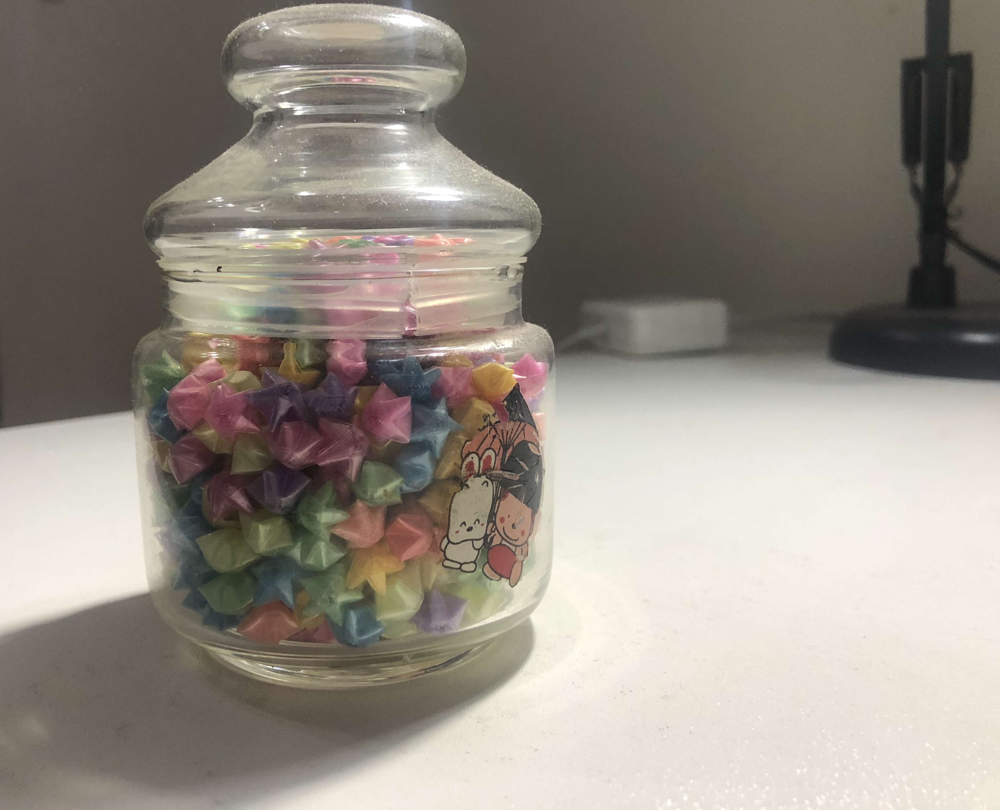

我其实是一个很恋旧的人，很多久远的东西我都一直留着，这罐幸运星我也是一直留着。

这是一个女孩子自己亲手折的，之前晚上关灯后还会发光来着，现在已经不发光了，但这个东西真的一直跟着我很多年了，一直放在我的办公桌上。

其实这个女孩子我并不太了解，她是在我高二的时候突然追求我的学妹，但是当时她追求我的时候，我已经与晶在一起了，我甚至没有考虑要不要跟她在一起的可能，就拒绝了。

但我内心里是十分珍惜她的勇气的，她对我的真心的，真是一个非常勇敢的女孩子。

她可能也是打听过来着，她知道我有女朋友，因此有一次在看我文艺演出的时候，故意站在晶（我的初恋）的旁边，问她是不是我的同学。

晶说是后，她有些挑蓄的说她想跟我表白，有一份情书要给我，问我女朋友愿不愿帮她转交。

哈哈，晶也答应了。但是她当时并没有把信给晶，而只是说信放在教室里，改天让晶转交。

这是晶跟我转述的事情，当时我听着觉得很好玩，觉得这个女孩子还真的是有个性，但我深爱着晶，因此也没有完全想要去了解对方，或者想要跟对方发展的想法。当时也是当做一件趣事听听而已。

后面信并没有让晶转交，我也不知道是怎么到我手里的，大概记得是她很招摇的在我教室门口看我，等我，后面我就有了那份信。

我不太记得那份信的内容后，看了后，当天我就在下课后在她教室门口等她，跟她简单的聊了一下然后把信件退回给她了，我一直不太清楚她的样子，也不记得她当时的表情。。。  我想一定很伤她的心吧！

那个时候的我是自私的，爱情本身也是自私的，我并未有顾忌她的感受，就找到她的教室，把信件退还给她了。

我知道了她的名字，大概记得了她的样子，仅此而已。

此后她就没有什么出格的行为了，但是偶尔在校园里也会碰到她，最多也是微笑着打个招呼而已。

有几次还看到她跟一个男生很开心的打闹着，为此她还特意找了机会跟我说，那个男生只是她的弟弟而已，但我觉得似乎也跟我没什么关系吧！！

我与她就是这样的关系，并未深入的互相了解过，她应该是很喜欢过我，但我却只是当做一件趣事。

后面她送了我图上的一罐幸运星，希望我一定要收下，收到这个的时候，我内心真的非常的感动，因为这个是她一点一点折起来的，而且每一个都折的非常工整，非常的好看。

如此用心的礼物，我真的不忍再退回伤对方的心，我不知道我还会不会遇到如此为我用心的女孩子。

我接受了她的礼物，但我并未作出其他的回应，只是把这个礼物好好的珍视。每每看到这个礼物还是会联想到她，感谢她。

我想如果不是因为我已经有女朋友了，我的心已经空缺不出空间来了，我一定还是想要深入的去了解她，去认识她的吧！

就这样，我迎来了毕业，也与晶分手了（虽然没有明确的说，但是内心都觉得似乎分手了），因为高考前的那段的时间，我与晶的关系弄的很僵。

现在想想大概是当时我被各种压力压着，晶有意梳离我，想让我认真学习吧！因为那个时候我是特别想考一个好学校的，晶反而是有种无所谓的态度。

填报志愿的时候我再班主任家里见到了晶，我们也没有怎么说话，感觉她想知道我报考的志愿，但最终还是互相不知道自己的志愿。

最终我们上了不同的大学，不同的城市，我整个大学其实有机会谈恋爱，但是我一直都未曾谈过恋爱。

有意思的是，在大学期间，我大二的时候，在招生办做兼职，迎接新生的时候，我看到了那个曾经喜欢我的女孩子，她竟然入读了我所在的大学。

多么奇妙的缘分呀！多么奇妙的事情呀！但也很奇怪的是，新生报到的时候我看到了她，但在平常的校园的生活我一直期待能碰见她，但一直也碰不到。

时间过了那么久，也许她已经完全对我没感觉了吧，而且那个时候我见到她也确实感觉到奇妙和开心，但没有心动的感觉。可我也非常期待能再次碰见她，想要深入的认识和了解她。

真的是非常有意思的事情呀！！她带给我很多奇妙的记忆呢！！

那个”崇洋媚外“的女孩子，是吗？你是否也觉得奇妙和美好呢！

李媚外：

不出意外的话，你的礼物可能会伴随我一辈子呢！谢谢你。

