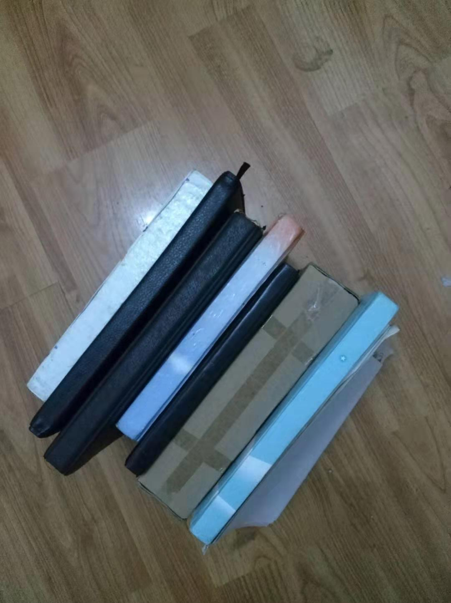

我有好几个笔记本，是从初中，高中，大学时候写的一些日记，我觉得倍感珍惜，去哪里都带着，自己偶尔看过1-2次，觉得好有意思，之后就没怎么看了.

想想为什么我如此珍惜这些日记本呢？

可能是因为这记录了我的成长，记录了我的青春。哪几年真的是非常快乐，有很多很多的促膝长谈，有很多很多对未来的憧憬.

现在是觉得挺幼稚的，但那种感觉是十分美好的，是对生活，对人性，对理想非常直接而真实的展望，似乎是源于人本能的东西.

我觉得我不应该把这些东西，这些感觉给遗忘了.

就想在海滩边捡贝壳一样，一点一点的捡起来，勿忘真实的自己，做真实的自己.

